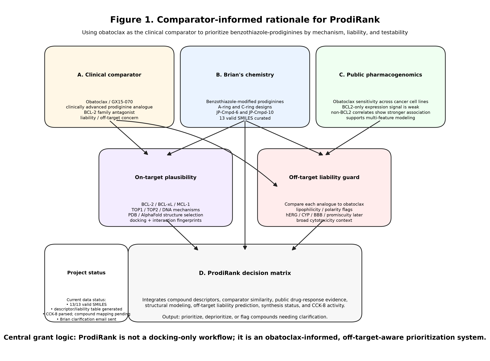
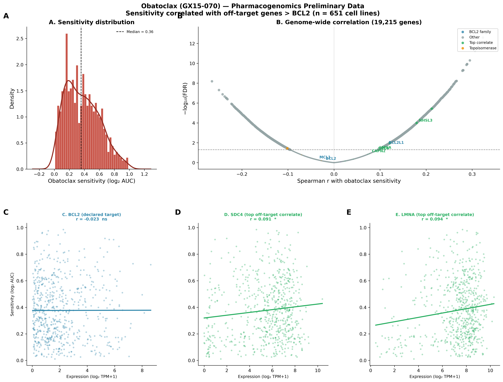
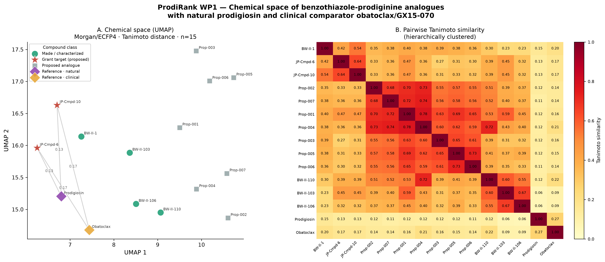
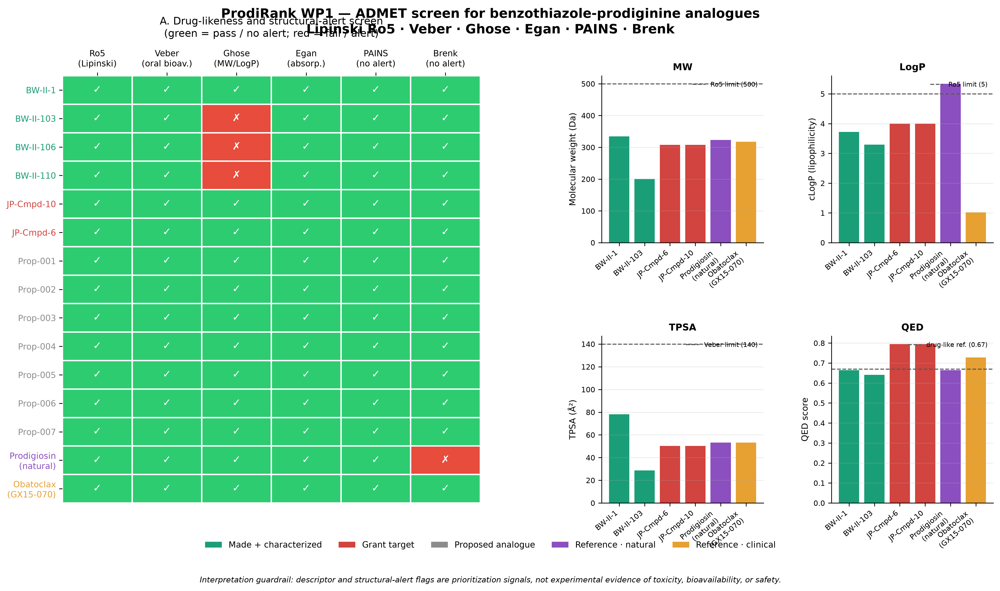

# ProdiRank


## Full Working Title

**ProdiRank: A Comparator-Informed Computational Pipeline to Prioritize Benzothiazole-Prodiginine Anti-Cancer Analogues**

## Short FOA-Compatible Title

**ProdiRank: Prioritizing Benzothiazole-Prodiginine Analogues**

The short title is intended for the AR INBRE Pilot Project application form, which limits the project title to 80 characters including spaces.

## Project Summary

ProdiRank is a collaborator-facing computational support repository for an AR INBRE Pilot Project application led by **Brian Walker**. The project supports a benzothiazole-prodiginine anti-cancer analogue program by adding a reproducible computational triage layer before additional synthesis and testing.

The wet-lab program focuses on synthesis, characterization, and biological testing of A-ring and C-ring benzothiazole-modified prodiginine analogues. ProdiRank contributes the computational arm: compound curation, SMILES validation, descriptor calculation, chemical-space analysis, preliminary ADMET/liability screening, public comparator pharmacogenomics audit, CCK-8 assay parsing, and candidate-prioritization logic.

The practical goal is to help the chemistry and cancer-biology team decide which analogues should be synthesized, tested, deprioritized, or held for clarification.

## Grant Mechanism Alignment

This repository is organized for the **AR INBRE Developmental Research Project Program — Pilot Project (PP)** mechanism.

Planned grant framework:

| Item | Planned Entry |
|---|---|
| Mechanism | Pilot Project / PP |
| Project Leader / PI | Brian Walker |
| Mentor | Robert Griffin |
| Co-Mentor / Computational Lead | Kalyani Dhusia |
| Institutional Submission | Brian's PUI signing official; final submission to AR INBRE |
| Undergraduate Trainee | STUDENT JOHN DOE, name to be replaced once confirmed |
| Project Period | May 1, 2027 – April 30, 2028 |
| Direct Cost Cap | $50,000 direct costs |
| Required PL Effort | 3 calendar months / 25% effort |
| Required Student Involvement | Minimum 1 undergraduate student |

## Scientific Rationale

Prodiginine compounds have reported anti-cancer activity, but their translational development is limited by normal-cell toxicity, unclear mechanism specificity, and physicochemical liabilities. Brian Walker's benzothiazole-prodiginine program explores an underdeveloped chemical space by introducing benzothiazole and benzothiazole derivatives into the prodiginine framework.

ProdiRank is designed to make that program more decision-driven. Rather than rank compounds only by synthetic accessibility or a single docking score, ProdiRank integrates multiple evidence layers:

1. chemical identity and structure validation,
2. protonation-aware physicochemical descriptors,
3. aqueous-solubility and drug-likeness flags,
4. comparator context using prodigiosin and obatoclax/GX15-070,
5. public drug-response and lineage-level evidence under audit,
6. synthesis and assay readiness,
7. tumor-versus-normal selectivity once mapped activity data are confirmed.

## Repository Structure

```text
.
├── LICENSE
├── README.md
├── README.docx
├── .gitignore
├── docs/
│   ├── brian_questions.docx
│   ├── data_dictionary.docx
│   └── project_overview.docx
├── environment/
│   ├── prodirank_py.yml
│   └── prodirank_r.yml
├── data/
│   ├── raw/
│   │   └── README.docx
│   ├── processed/
│   │   └── README.docx
│   └── external/
│       └── README.docx
├── notebooks/
│   ├── 01_data_intake_cleaning.ipynb
│   ├── 02_obatoclax_pharmacogenomics.ipynb
│   ├── 03_wp1_tanimoto_umap.ipynb
│   ├── 04_wp1_admet_screening.ipynb
│   └── 05_activity_cck8_parsing.ipynb
├── scripts/
│   ├── clean_compound_manifest.py
│   ├── parse_cck8_activity.py
│   ├── run_admet_screen.py
│   └── run_tanimoto_umap.py
├── outputs/
│   ├── figures/
│   ├── tables/
│   └── audits/
├── grant/
│   ├── budget_notes.docx
│   ├── future_directions.docx
│   └── specific_aims_draft.docx
└── reports/
    ├── ProdiRank_grant_report_outline.docx
    └── ProdiRank_grant_report_v1.docx
```

## Current Computational Modules

| Module | Status | Main Repository Files |
|---|---|---|
| Data intake and compound manifest | First-pass complete | `./notebooks/01_data_intake_cleaning.ipynb`; `./outputs/tables/compound_manifest_clean.csv` |
| CCK-8 activity parsing | Technically parsed; biological interpretation pending assay-layout confirmation | `./notebooks/05_activity_cck8_parsing.ipynb`; `./outputs/tables/cck8_raw_well_values.csv`; `./outputs/tables/cck8_summary_tidy.csv`; `./outputs/tables/ec50_summary.csv` |
| Obatoclax/GX15-070 pharmacogenomics | Preliminary and under audit | `./notebooks/02_obatoclax_pharmacogenomics.ipynb`; `./outputs/tables/public_obatoclax_gene_summary.csv` |
| Chemical-space/Tanimoto analysis | First-pass complete; grant interpretation under review | `./notebooks/03_wp1_tanimoto_umap.ipynb`; `./outputs/figures/wp1_tanimoto_umap.png` |
| ADMET/liability screening | First-pass complete; next version will add protonation-aware descriptors | `./notebooks/04_wp1_admet_screening.ipynb`; `./outputs/figures/wp1_admet_trafficlight.png` |
| Candidate ranking engine | Planned Aim 3 deliverable | future script/table under `./scripts/` and `./outputs/tables/` |

## Key Repository Figures

### Figure 1 — Project rationale

Path:

```text
./outputs/figures/Figure1_ProdiRank_rationale_v1.png
```

Markdown embed placeholder:

markdown



Purpose: summarizes the comparator-informed rationale and how the computational layer supports wet-lab prioritization.

### Figure 2 — Obatoclax pharmacogenomics summary

Path:

```text
./outputs/figures/fig8_grant_multipanel.png
```

Markdown embed placeholder:

```markdown

```

Purpose: provides a preliminary public-data comparator analysis. This figure is currently under audit and should be interpreted cautiously until the response metric, dataset version, sample count, and correlation reproducibility checks are finalized.

### Figure 3 — Chemical-space and Tanimoto analysis

Path:

```text
./outputs/figures/wp1_tanimoto_umap.png
```

Markdown embed placeholder:

```markdown

```

Purpose: visualizes compound relationships using fingerprint similarity and chemical-space projection.

### Figure 4 — ADMET and liability screen

Path:

```text
./outputs/figures/wp1_admet_trafficlight.png
```

Markdown embed placeholder:

```markdown

```

Purpose: summarizes first-pass drug-likeness and structural-alert screening. The next version should add pKa, logD at pH 7.4, aqueous solubility, and tautomer-standardized descriptor generation.

## Key Repository Tables

| Table | Path | Use |
|---|---|---|
| Compound manifest | `./outputs/tables/compound_manifest_clean.csv` | Cleaned compound labels, SMILES, and parsing status |
| Compound manifest workbook | `./outputs/tables/compound_manifest_clean.xlsx` | Collaborator-facing review table |
| CCK-8 raw well values | `./outputs/tables/cck8_raw_well_values.csv` | Technical parsing of raw assay values |
| CCK-8 summary table | `./outputs/tables/cck8_summary_tidy.csv` | Tidy summary table for activity interpretation after layout confirmation |
| Preliminary EC50 table | `./outputs/tables/ec50_summary.csv` | Held for interpretation until labels map to structures and cell lines |
| Public comparator gene summary | `./outputs/tables/public_obatoclax_gene_summary.csv` | Preliminary pharmacogenomic summary under audit |

Markdown table-link examples:

```markdown
[Compound manifest](./outputs/tables/compound_manifest_clean.csv)

[CCK-8 summary table](./outputs/tables/cck8_summary_tidy.csv)

[Preliminary EC50 summary](./outputs/tables/ec50_summary.csv)
```

## Proposed Pilot Project Aims

### Aim 1 — Build a protonation-aware physicochemical and liability model

**Goal:** Generate a scaffold-appropriate descriptor and liability model for benzothiazole-prodiginine candidates.

Planned computational outputs:

- standardized canonical structures,
- exact-mass checks against experimental characterization where available,
- pKa estimate for the most basic center,
- logD at pH 7.4,
- aqueous solubility estimate,
- MW, TPSA, HBD/HBA, rotatable bonds, QED,
- PAINS and Brenk structural-alert checks,
- candidate-level physicochemical/liability summary table.

### Aim 2 — Define comparator-informed cell-line and liability context

**Goal:** Use prodigiosin and obatoclax/GX15-070 as comparator compounds to guide biological interpretation and cell-line prioritization.

Current status:

- preliminary public pharmacogenomic analysis has been run,
- gene-level claims remain under audit,
- lineage-level and comparator-context analysis may be retained after audit,
- no strong mechanism claim should be made from public correlations alone.

Planned computational outputs:

- dataset audit table,
- response metric documentation,
- lineage sensitivity summary,
- analysis of whether comparator signals support the planned tumor and normal-cell panel,
- report-ready figure only after reproducibility checks pass.

### Aim 3 — Develop ProdiRank as a prospective prioritization workflow

**Goal:** Build a reproducible workflow that ranks candidates by scaffold novelty, physicochemical feasibility, predicted solubility, liability flags, synthesis feasibility, assay readiness, and experimental-readiness metadata.

Planned output:

```text
candidate structure registry
        ↓
standardization and authentication gates
        ↓
protonation-aware descriptors
        ↓
solubility and liability screen
        ↓
comparator-context audit
        ↓
pre-registered ranking weights
        ↓
ranked synthesis/testing queue
        ↓
prospective feasibility/calibration against tumor-versus-3T3 selectivity
```

The prospective component should be framed as feasibility and calibration, not definitive model validation. The likely test is whether top-ranked candidates show better tumor-versus-normal selectivity than lower-ranked candidates after synthesis and CCK-8 testing.

## Proposed Pipeline Logic

```text
1. Intake
   Walker compound list
   Figure 4 target structures
   CCK-8 assay files and layout map
   Public comparator data

2. Structure authentication gate
   SMILES parsing
   exact-mass check
   reference-compound checks
   halt if structure identity is unresolved

3. Standardization
   salt removal where applicable
   tautomer standardization
   canonical SMILES
   Murcko-scaffold coherence check

4. Aim 1 descriptors
   pKa
   logD 7.4
   logS
   MW / TPSA / HBD / HBA / QED
   PAINS / Brenk alerts

5. Aim 2 comparator context
   public data audit
   lineage-level sensitivity summary
   gene-level analysis only if reproducibility checks pass

6. Aim 3 ranking
   pre-registered weights
   composite score
   ranked synthesis/testing queue

7. Wet-lab feedback
   CCK-8 viability
   IC50 / EC50 / IC80 where appropriate
   3T3-versus-tumor selectivity
   clonogenic or radiation-synergy follow-up if budget allows
```

## Budget Framework

The Pilot Project budget should use the sample budget workbook as a strategy guide and starting point for a real draft budget. Actual entries require Brian's PUI salary, fringe, student-pay structure, reagent quotes, assay costs, travel estimates, and any approved computational-cost mechanism.

Recommended budget categories:

| Category | Purpose | Notes |
|---|---|---|
| Personnel | Brian Walker effort; undergraduate student support | Must align with PP effort and student-participation requirements |
| Supplies | synthesis reagents, solvents, purification supplies, CCK-8 kits, cell culture consumables | Should be tied directly to Aims 1–3 |
| Equipment | only if justified and allowed | Avoid nonessential equipment in a $50K PP unless mission-critical |
| Travel | INBRE meeting and/or scientific presentation | Should support student and PL dissemination |
| Other Costs | publication, core usage, assay/service costs, computational charges if allowed | Confirm exact mechanism before budgeting computational support |

Budget principle:

```text
wet-lab synthesis/testing remains the funded experimental engine;
ProdiRank is the computational decision-support layer that reduces wasted synthesis and assay effort.
```

## Report Alignment

The main collaborator-facing report should parallel this README.

Recommended report path:

```text
./reports/ProdiRank_grant_report_v1.docx
```

Recommended report structure:

1. Executive Summary
2. Wet-Lab Context and Prior Work
3. ProdiRank Computational Rationale
4. Repository and Reproducibility Structure
5. Data Inputs and Audit Status
6. Compound Manifest and SMILES Validation
7. Chemical-Space/Tanimoto Analysis
8. ADMET/Liability Screening
9. Obatoclax/GX15-070 Pharmacogenomics Under Audit
10. CCK-8 Activity Parsing Status
11. Proposed PP Aims
12. Proposed Pipeline and Decision Rules
13. Budget-Relevant Computational Support
14. Immediate Next Steps
15. Appendix: Figures and Tables

## Current Interpretation Guardrails

Use the following language rules in the report and grant draft:

- Say **first-pass** or **preliminary** for current computational results.
- Say **technically parsed** for CCK-8 outputs until assay layout is confirmed.
- Say **under audit** for obatoclax pharmacogenomics.
- Do not interpret EC50/IC50 values until each assay label maps to a compound, cell line, concentration series, and plate condition.
- Do not make a strong target-engagement claim from chemical similarity or public correlation alone.
- Do not frame the prospective ranking as definitive validation; frame it as pilot-scale feasibility and calibration.

## Running the Computational Environment

Create the Python environment:

```bash
mamba env create -f ./environment/prodirank_py.yml
mamba activate prodirank-py
```

Create the R environment:

```bash
mamba env create -f ./environment/prodirank_r.yml
mamba activate prodirank-r
```

Project rule:

```text
Use conda/mamba first. Avoid pip unless the package is unavailable through conda-forge/bioconda or there is a strong reason.
```

## Notebook Order

Run notebooks in this order:

```text
1. ./notebooks/01_data_intake_cleaning.ipynb
2. ./notebooks/03_wp1_tanimoto_umap.ipynb
3. ./notebooks/04_wp1_admet_screening.ipynb
4. ./notebooks/02_obatoclax_pharmacogenomics.ipynb
5. ./notebooks/05_activity_cck8_parsing.ipynb
```

The CCK-8 notebook can be run earlier for technical parsing, but biological interpretation requires the assay layout map.

## Milestone & Supervision Checklist

### Phase 0 — Repository and grant-readiness setup

| Done | Task | Owner | Deliverable |
|---|---|---|---|
| [ ] | Confirm repo visibility strategy during grant/manuscript preparation | Kalyani + Brian | Repository access decision |
| [ ] | Confirm PP mechanism and submission path | Brian | PP-only planning decision |
| [ ] | Confirm institutional signing official process | Brian | Submission workflow confirmed |
| [ ] | Confirm grant-writing workshop status or needed follow-up | Brian | Compliance note for application |
| [ ] | Confirm final project title under 80 characters | Brian + Kalyani | FOA-compatible title |

### Phase 1 — Compound registry and identity audit

| Done | Task | Owner | Deliverable |
|---|---|---|---|
| [ ] | Confirm final compound list for PP application | Brian | Approved compound registry |
| [ ] | Provide final SMILES for target structures | Brian | Final structure table |
| [ ] | Confirm synthesis and characterization status | Brian | Synthesis-status table |
| [ ] | Provide HRMS/NMR reference values where available | Brian | Chemical-resource authentication inputs |
| [ ] | Re-run SMILES validation and exact-mass checks | Kalyani | Updated compound manifest |
| [ ] | Create final data dictionary for compounds and assay labels | Kalyani | `./docs/data_dictionary.docx` update |

### Phase 2 — CCK-8 assay mapping and biological interpretation

| Done | Task | Owner | Deliverable |
|---|---|---|---|
| [ ] | Confirm what each CCK-8 label represents | Brian / assay generator | Assay-layout map |
| [ ] | Confirm compound, cell line, concentration, timepoint, and replicate structure | Brian / assay generator | Parsed assay metadata table |
| [ ] | Recalculate IC50/EC50/IC80 only after mapping is confirmed | Kalyani | Updated activity table |
| [ ] | Define tumor-versus-normal selectivity metric | Brian + Robert + Kalyani | Selectivity-ratio decision rule |
| [ ] | Identify which assays are realistic within PP budget | Brian + Robert | Final wet-lab assay scope |

### Phase 3 — Aim 1: Protonation-aware descriptor and liability model

| Done | Task | Owner | Deliverable |
|---|---|---|---|
| [ ] | Add tautomer standardization to structure pipeline | Kalyani | Updated descriptor script |
| [ ] | Add pKa, logD 7.4, and logS estimates | Kalyani | Protonation-aware descriptor table |
| [ ] | Re-run PAINS/Brenk alerts after standardization | Kalyani | Updated liability table |
| [ ] | Check descriptor coherence across related scaffolds | Kalyani | Descriptor audit note |
| [ ] | Summarize results for Significance/Innovation section | Kalyani | Report-ready text block |

### Phase 4 — Aim 2: Comparator pharmacogenomics under audit

| Done | Task | Owner | Deliverable |
|---|---|---|---|
| [ ] | Freeze public-data source files, versions, and dates | Kalyani | Dataset audit table |
| [ ] | Confirm response metric and metric direction | Kalyani | Analysis audit note |
| [ ] | Confirm unique cell-line count and matched-profile count | Kalyani | Reproducibility note |
| [ ] | Resolve or remove gene-level correlation claims | Kalyani | Cleaned comparator-analysis section |
| [ ] | Retain only defensible lineage/context findings for PP application | Kalyani + Brian + Robert | Final comparator figure/text |

### Phase 5 — Aim 3: ProdiRank prioritization workflow

| Done | Task | Owner | Deliverable |
|---|---|---|---|
| [ ] | Define candidate scoring categories | Kalyani + Brian + Robert | Scoring rubric |
| [ ] | Pre-register ranking weights before scoring | Kalyani + Brian + Robert | Locked ranking table |
| [ ] | Generate ranked synthesis/testing queue | Kalyani | ProdiRank candidate-priority table |
| [ ] | Review feasibility of top-ranked compounds | Brian | Synthesis-feasibility note |
| [ ] | Use ranked order to guide pilot-scale synthesis/testing where feasible | Brian | As-designed vs as-executed synthesis order |
| [ ] | Compare top-ranked versus lower-ranked candidates using tumor-versus-3T3 selectivity | Brian + Robert + Kalyani | Feasibility/calibration result |

### Phase 6 — Undergraduate training and supervision

| Done | Task | Owner | Deliverable |
|---|---|---|---|
| [ ] | Replace STUDENT JOHN DOE with confirmed undergraduate trainee name | Brian | Student assignment |
| [ ] | Train student in compound registry management and reproducible notebooks | Kalyani | Training checklist |
| [ ] | Train student in synthesis/assay context and lab-record interpretation | Brian | Wet-lab training note |
| [ ] | Assign weekly student task log | Brian + Kalyani | Weekly supervision record |
| [ ] | Include student in figure/table QC before report submission | Kalyani | QC sign-off |
| [ ] | Prepare student for poster/report presentation | Brian + Robert + Kalyani | Dissemination product |

### Phase 7 — Grant package assembly

| Done | Task | Owner | Deliverable |
|---|---|---|---|
| [ ] | Write Specific Aims page | Kalyani + Brian | 1-page Specific Aims draft |
| [ ] | Write Significance and Innovation section | Kalyani + Brian | 1-page combined section |
| [ ] | Write wet-lab Approach | Brian + Robert | Approach section |
| [ ] | Write computational Approach | Kalyani | Approach section |
| [ ] | Prepare budget and budget justification | Brian + Kalyani | Draft budget workbook and justification |
| [ ] | Prepare biosketches | Brian + Robert + Kalyani | NIH biosketches |
| [ ] | Prepare resources/equipment page | Brian + Kalyani | 1-page Resources section |
| [ ] | Prepare authentication of key biological/chemical resources | Brian + Kalyani | Authentication section |
| [ ] | Prepare resource-sharing language for code and derived tables | Kalyani | Resource-sharing section |
| [ ] | Assemble final single-PDF application | Brian's PUI signing official | Submitted application |

## Primary Near-Term Action Items

```text
1. Confirm final PP-only scope.
2. Confirm assay-layout mapping for CCK-8 files.
3. Confirm final target-compound structures.
4. Update descriptor pipeline with pKa, logD 7.4, and logS.
5. Audit obatoclax pharmacogenomics before using gene-level claims.
6. Build the ProdiRank scoring rubric.
7. Draft the Specific Aims page and budget justification.
```
